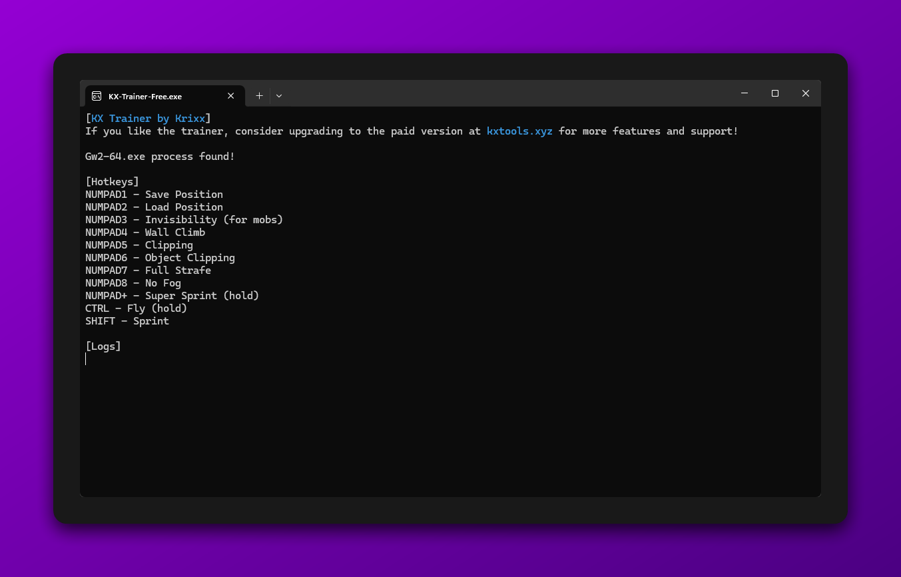

# KX Trainer Free

KX Trainer Free is a simple game trainer for Guild Wars 2 that we've decided to make open-source. The code is quite old, and we don't feel the need to keep it private anymore. It was originally started back in 2018 and has received some small updates over the years, but nothing too major.



## Why Open-Source?

We believe that transparency is important, especially for a project like this. KX Trainer Free is a simple tool that’s been around for quite some time. Rather than keeping it private, we’ve decided to open it up to the community in the hope that others might find it useful or learn from it.

This project is no longer actively maintained as our focus has shifted towards our paid products available at [kxtools.xyz](https://kxtools.xyz). However, we encourage contributions and hope the community can help improve and maintain it going forward.

## A Little History

KX Trainer Free started as a small hobby project in 2018. Over the years, it received small updates here and there, but the core functionality has largely remained the same. The code, while functional, is still quite messy despite some cleanup before making it open-source.

## Contributions

We welcome contributions! Whether it's cleaning up the code, fixing bugs, or adding new features, feel free to submit a pull request. Since this project isn't actively maintained, your input will help keep it in shape.

## How to Use

KX Trainer Free is a C++ project designed to work on Windows using Visual Studio.

### Prerequisites
- **Visual Studio**: Ensure that you have Visual Studio installed, with the C++ development environment set up.

### Build Instructions

1. **Clone the Repository**:
   Open your terminal or Git Bash, and clone the repository:
   ```bash
   git clone https://github.com/Krixx1337/KX-Trainer-Free.git
   ```

2. **Open the Project in Visual Studio**:
   - Launch Visual Studio.
   - Open the .sln file located in the cloned repository.
