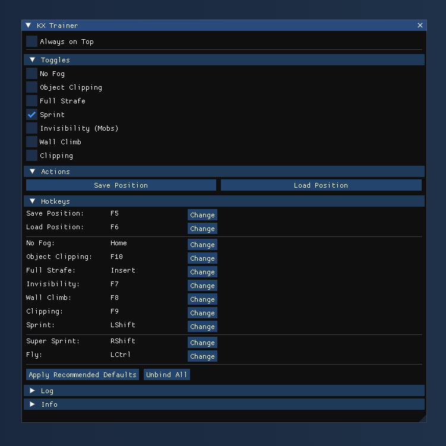

# KX Trainer Free

KX Trainer Free is a simple game trainer for Guild Wars 2 that we've decided to make open-source. The code has evolved since its origin in 2018, and we believe in transparency for tools like this.

[➡️ Download the Latest Release](https://github.com/Krixx1337/KX-Trainer-Free/releases/latest)



## Why Open-Source?

We believe transparency is important, especially for game tools. KX Trainer Free has been around for a while, and opening it up allows the community to see how it works, learn from it, or contribute.

While our main development efforts focus on the advanced features in our paid tools available at [kxtools.xyz](https://kxtools.xyz), **KX Trainer Free will be actively maintained** to ensure it remains functional after Guild Wars 2 updates and to fix critical bugs. However, new features exclusive to the paid version will not be added here. We hope the community finds this base useful and potentially builds upon it.

## A Little History

Originating as a hobby project in 2018, KX Trainer Free has evolved significantly. The codebase, while functional in its earlier versions, has recently undergone substantial refactoring to improve structure, clarity, and maintainability, resulting in a much cleaner state.

## Contributions

We welcome contributions! Pull requests for **bug fixes**, **compatibility updates** following game patches, or **code improvements** are highly encouraged. While new features mirroring the paid version won't be merged, community-driven additions that fit the scope of the free trainer are welcome for discussion. Your input is valuable in keeping this tool functional for everyone.

## How to Use

KX Trainer Free is a C++ project designed to work on Windows using Visual Studio.

### Prerequisites
- **Visual Studio**: Ensure that you have Visual Studio installed (2019 or later recommended), with the C++ Desktop Development workload.

### Build Instructions

1.  **Clone the Repository**:
    Open your terminal or Git Bash, and clone the repository:
    ```bash
    git clone https://github.com/Krixx1337/KX-Trainer-Free.git
    ```

2.  **Open the Project in Visual Studio**:
    *   Navigate to the cloned repository directory.
    *   Open the `KX-Trainer-Free.sln` file with Visual Studio.
    *   Select the desired build configuration (e.g., Debug/Release, x64).
    *   Build the solution (Build > Build Solution or `Ctrl+Shift+B`).

## Contact

For any questions or support, feel free to join our [Discord server](https://discord.gg/z92rnB4kHm).